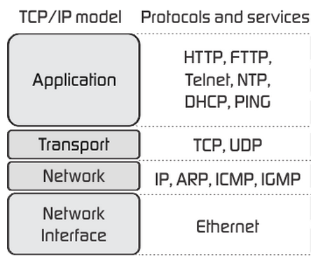

# UDP

在上一节中我们已经介绍了 Go [net](https://golang.org/pkg/net/) 包的 TCP 的用法，那么今天我们就来讲讲 net 中另外一个传输层协议 UDP 的用法。

UDP 名叫用户数据报协议（英语：User Datagram Protocol，缩写：UDP；又称用户数据包协议）是一个简单的面向数据报的通信协议，和 TCP 一样，它也是位于IP 层和应用层之间的传输层，它是主要应用层协议 FTP、QUIC、RTP 等的底层支持。

参见 TCP/IP 4 层的分层图：



### 基本知识

UDP 相较于 TCP 简单的多，它具有以下特点：

- 无连接的
- 要求系统资源较少 
- UDP 程序结构较简单 
- 基于数据报模式
- UDP 可能丢包 
- UDP 不保证数据顺序性 

核心 API 如下：

- 创建 UDP Server:

```
laddr, _ := net.ResolveUDPAddr("udp", "127.0.0.1:3000")
c, err := net.ListenUDP("udp", laddr)
```

>> 注意： `ListenUDP` 方法，其实是创建一个 UDPConn，我们可以通过此 UDPConn 来收发包，收包的时候可以获取客户端的地址。 

- 接收数据:

```
n, addr, err := c.ReadFrom(buf)
```

>> 注意： 返回数据的 addr 就是数据包发送的地址，从而可以根据此地址来回复客户端信息。 

- 发送数据：

```
n, err := c.WriteTo([]byte("pong"), addr)
```

- 设置读超时时间:

```
c.SetReadDeadline(time.Now().Add(defaultTimeout))
```

- 设置写超时时间:

```
c.SetWriteDeadline(time.Now().Add(defaultTimeout))
```

>> 注意： `SetReadDeadline`、`SetWriteDeadline` 方法的参数为具体的时刻，而不是时间间隔（time.Duration）。

- 关闭连接：

```
c.Close()
```

>> 注意：连接用完之后，需要通过此方法来进行资源释放，不然会出现句柄泄露的问题。

- 客户端创建 UDP 连接:

```go
c, err := net.Dial("udp", "ip:port")
```

>>  `Dial` 其实是 net 包的一个辅助方法，它不仅支持 `tcp` 的连接创建，还支持 `udp`, `ip`, `unix`，它等价于以下操作：

```go
// 指定本地地址
laddr, _ := net.ResolveUDPAddr("udp", "0.0.0.0:0")
// 服务端地址
raddr, _ := net.ResolveUDPAddr("udp", "ip:port")
// 创建连接
c, err := net.DialUDP("tcp", laddr, raddr)
```


### 实战示例

下面我们通过一个统计服务在线人数的例子来了解它的用法:

- server/main.go

```golang
package main

import (
	"log"
	"net"
	"time"
)

func main() {
	// 监听本地地址并等待接收包
	laddr, _ := net.ResolveUDPAddr("udp", "127.0.0.1:3000")
	c, err := net.ListenUDP("udp", laddr)
	if err != nil {
		log.Fatal(err)
	}
	log.Printf("udp server listen via : %s", c.LocalAddr())

	defer c.Close()

	// 缓存所有的客户端
	clients := make([]net.Addr, 0)

	// 分别向所有的客户端回包
	go func() {
		for {
			for _, addr := range clients {
				_, err := c.WriteTo([]byte("pong"), addr)
				if err != nil {
					log.Println(err)
				}
			}

			time.Sleep(5 * time.Second)
		}
	}()

	// 等待客户端的连接，并缓存客户端的地址
	for {
		buf := make([]byte, 256)
		n, addr, err := c.ReadFrom(buf)
		if err != nil {
			log.Println(err)
			continue
		}

		clients = append(clients, addr)
		log.Println(string(buf[0:n]))
		log.Println(addr.String(), "connecting...", len(clients), "connected")
	}
}
```

注意：
	1. 监听本地 UDP `127.0.0.1:3000`。
	2. 使用 `pc.ReadFrom(buf)` 方法读取客户端发送的消息。
	3. 使用 `clients` 来保存所有连上的客户端连接。
	4. 通过 `pc.WriteTo([]byte("pong"), addr)` 向所有客户端发送消息。

- client/main.go

```golang
package main

import (
	"log"
	"net"
)

func main() {
	c, err := net.Dial("udp", "127.0.0.1:3000")
	if err != nil {
		log.Fatal(err)
	}

	defer c.Close()

	// 发送消息
	_, err = c.Write([]byte("ping"))
	if err != nil {
		log.Fatal(err)
	}

	// MTU 一般小于 1500 字节
	buf := make([]byte, 1500)

	// 持续读数据
	for {
		n, _ := c.Read(buf)
		if err != nil {
			log.Fatal(err)
		}

		log.Println(string(buf[:n]))
	}
}
```

当我运行代码可以得到如下输出：

```
# 执行命令
go run server/main.go

# 输出
2020/06/02 21:13:49 udp server listen via : 127.0.0.1:3000
2020/06/02 21:15:14 ping
2020/06/02 21:15:14 127.0.0.1:54328 connecting... 1 connected
2020/06/02 21:15:17 ping
2020/06/02 21:15:17 127.0.0.1:56310 connecting... 2 connected
```

```
# 启动 client1
go run client/main.go

# 输出
2020/06/02 21:15:14 pong
2020/06/02 21:15:19 pong
```

```
# 启动 client2
go run client/main.go

# 输出
2020/06/02 21:15:19 pong
2020/06/02 21:15:24 pong
```

参考资料：

- [维基百科](https://zh.wikipedia.org/wiki/%E7%94%A8%E6%88%B7%E6%95%B0%E6%8D%AE%E6%8A%A5%E5%8D%8F%E8%AE%AE)
- [Go Net 库](https://golang.org/pkg/net)
- [示例代码](https://github.com/binatify/importgo/tree/master/src/ch10/udp)